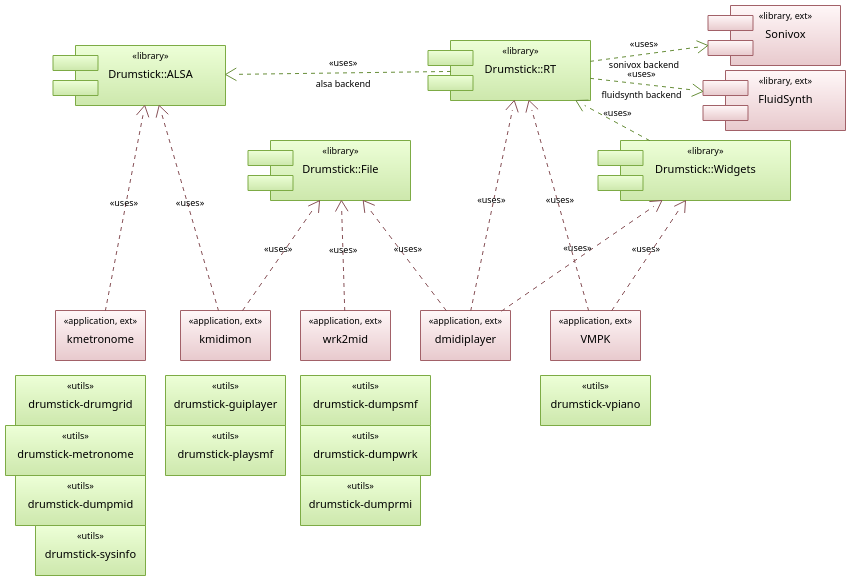

# Drumstick Libraries

Drumstick is a set of MIDI libraries using C++/Qt idioms and style. Includes a C++ wrapper around the ALSA library sequencer interface: ALSA sequencer provides software support for MIDI technology on Linux. A complementary library provides classes for processing SMF (Standard MIDI files: .MID/.KAR), RIFF RMID (*.rmi) and Cakewalk (.WRK) file formats. A multiplatform realtime MIDI I/O library and a GUI Widgets libraries are also provided for Linux, Windows, and Mac OSX.

Currently, there are four libraries designed to work together if/when needed:

* **Drumstick::ALSA** is a Linux only C++/Qt wrapper around the ALSA Sequencer API. ALSA sequencer provides software support for MIDI technology on Linux.
* **Drumstick::File** provides easy multiplatform file I/O for Standard MIDI Files (.mid), RIFF RMID (.rmi)  and Cakewalk (.wrk) file formats.
* **Drumstick::RT** is a realtime MIDI I/O library with pluggable backends. It uses Drumstick::ALSA on Linux, and other native frameworks on macOS and Windows.
* **Drumstick::Widgets** contains MIDI widgets, including a Virtual Piano used by VMPK among other programs.

**Drumstick::ALSA** was the first library developed under the Drumstick umbrella, and is available only on Linux, because ALSA Sequencer is an exclusive Linux technology. For realtime I/O applications you can use the **Drumstick::RT** library which is multiplatform, and only depends on **Drumstick::ALSA** in Linux for its ALSA Sequencer backend. Other multiplatform backends are: Network/[ipMIDI](https://www.nerds.de/en/ipmidi.html) and [Fluidsynth](https://github.com/FluidSynth/fluidsynth). The [Sonivox](https://github.com/pedrolcl/sonivox) backend needs PulseAudio, which is available on most Unix systems.

There are ten examples in the source tree, under the utils/ directory:

* drumgrid: GUI program. Simple drum patterns. Depends on Drumstick::ALSA.
* dumpmid: CLI program. Prints received MIDI events. Depends on Drumstick::ALSA. See also [kmidimon](https://kmidimon.sourceforge.io)
* dumprmi: CLI program. Prints and converts RIFF MIDI files. Depends on Drumstick::File.
* dumpsmf: CLI program. Prints standard MIDI files. Depends on Drumstick::File.
* dumpwrk: CLI program. Prints Cakewalk/Sonar MIDI files. Depends on Drumstick::File. See also [wrk2mid](https://wrk2mid.sourceforge.io)
* guiplayer: GUI program. Plays SMF and Cakewalk files. Depends on Drumstick::ALSA and Drumstick::File. See also [dmidiplayer](https://dmidiplayer.sourceforge.io)
* metronome: CLI program. Simple command line MIDI metronome. Depends on Drumstick::ALSA. See also [kmetronome](https://kmetronome.sourceforge.io)
* playsmf: CLI program. SMF player. Depends on Drumstick::ALSA and Drumstick::File.
* sysinfo: CLI program. Prints information about the ALSA sequencer subsystem. Depends on Drumstick::ALSA.
* vpiano: GUI program. A simple Virtual Piano Keyboard GUI application. Depends on Drumstick::RT. See also [VMPK](http://vmpk.sourceforge.io).

And you can also see independent applications using this library:

* [dmidiplayer](https://sourceforge.net/p/dmidiplayer): Multiplatform MIDI file player with many features.
* [VMPK](https://sourceforge.net/p/vmpk): Multiplatform Virtual MIDI Piano Keyboard.
* [kmetronome](https://sourceforge.net/p/kmetronome): MIDI metronome for Linux.
* [kmidimon](https://sourceforge.net/p/kmidimon): MIDI monitor for Linux.
* [wrk2mid](https://sourceforge.net/p/wrk2mid): Command line utility to convert WRK files to SMF.

Here is a diagram about the relationship between the libraries and applications:

The main web site of this project is [drumstick.sourceforge.io](https://drumstick.sourceforge.io)

See also:

* [Downloads](https://sourceforge.net/projects/drumstick/files/)
* [Online documentation](https://drumstick.sourceforge.io/docs/index.html)
* [Build and install documentation](install.md)
