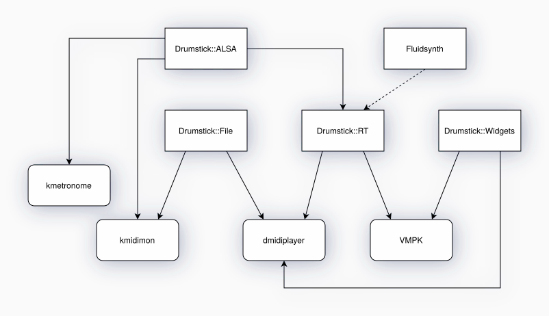

# Drumstick Libraries

Drumstick is a set of MIDI libraries using C++/Qt5 idioms and style. Includes a C++ wrapper around the ALSA library sequencer interface: ALSA sequencer provides software support for MIDI technology on Linux. A complementary library provides classes for processing SMF (Standard MIDI files: .MID/.KAR), and Cakewalk (.WRK) file formats. A multiplatform realtime MIDI I/O library and a GUI Widgets libraries are also provided for Linux, Windows, and Mac OSX.

Currently, there are four libraries designed to work together if/when needed:

* **Drumstick::ALSA** is a Linux only C++/Qt wrapper around the ALSA Sequencer API. ALSA sequencer provides software support for MIDI technology on Linux.
* **Drumstick::File** provides easy multiplatform file I/O for Standard MIDI Files (.mid) and Cakewalk (.wrk) file formats.
* **Drumstick::RT** is a realtime MIDI I/O library with pluggable backends. It uses Drumstick::ALSA on Linux, and other native frameworks on macOS and Windows.
* **Drumstick::Widgets** contains MIDI widgets, including a Virtual Piano used by VMPK among other programs

**Drumstick::ALSA** was the first library developed under the Drumstick umbrella, and is available only on Linux, because ALSA Sequencer is an exclusive Linux technology. For realtime IO applications you can use the **Drumstick::RT** library which is multiplatform, and only depends on **Drumstick::ALSA** in Linux for its ALSA Sequencer backend. Other multiplatform backends are: Network/[ipMIDI](https://www.nerds.de/en/ipmidi.html) and [Fluidsynth](https://github.com/FluidSynth/fluidsynth).

There are nine examples in the source tree, under the utils/ directory:

* drumgrid: GUI program. Simple drum patterns.
* dumpmid: CLI program. Prints received MIDI events.
* dumpsmf: CLI program. Prints standard MIDI files.
* dumpwrk: CLI program. Prints Cakewalk/Sonar MIDI files.
* guiplayer: GUI program. Plays SMF and Cakewalk files.
* metronome: CLI program. Simple command line MIDI metronome.
* playsmf: CLI program. SMF player.
* sysinfo: CLI program. Prints information about the ALSA sequencer subsystem.
* vpiano: GUI program. A simple Virtual Piano Keyboard GUI application. See also [VMPK](http://vmpk.sourceforge.io).

And you can also see independent applications using this library:

* [kmetronome](https://sourceforge.net/p/kmetronome): MIDI metronome for Linux.
* [kmidimon](https://sourceforge.net/p/kmidimon): MIDI monitor for Linux.
* [dmidiplayer](https://sourceforge.net/p/dmidiplayer): Multiplatform MIDI file player with many features.
* [VMPK](https://sourceforge.net/p/vmpk): Multiplatform Virtual MIDI Piano Keyboard.

Here is a diagram about the relationship between the libraries and the applications:

The main web site of this project is [drumstick.sourceforge.io](https://drumstick.sourceforge.io)

See also:

* [Downloads](https://sourceforge.net/projects/drumstick/files/)
* [Online documentation](https://drumstick.sourceforge.io/docs/index.html)
* [Build and install documentation](install.md)
